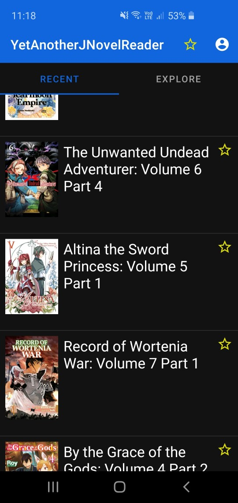
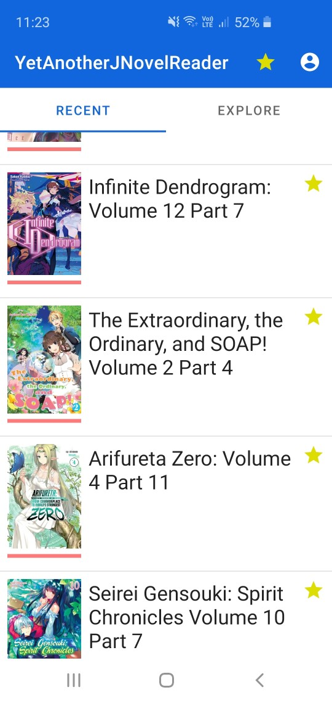
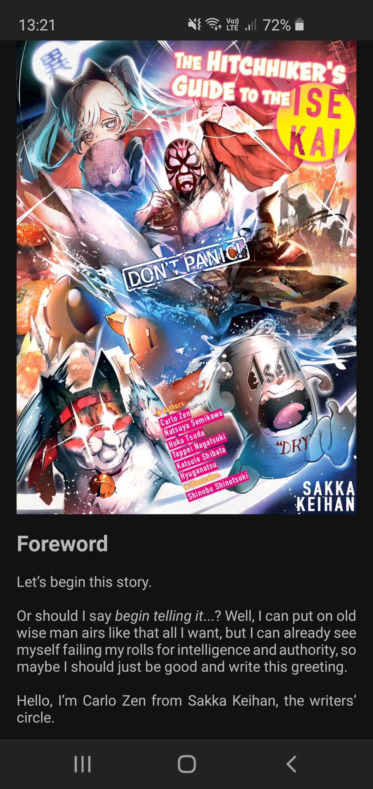

# YetAnotherJNovelReader

An (unofficial) alternative to [J-Novel Club](https://j-novel.club/about)'s [official reader app](https://play.google.com/store/apps/details?id=com.jnovelapp) for Android since, as of the time of writing, the official app has been riddled with issues with no updates in sight.

## Features

   

On top of having most of the features included in the official app (less important features such as links for purchasing ebooks and the series search functionality are missing):
 - Tag series that you follow and filter new parts to those parts in those series
 - More complete day/night theme support
The UI is also (subjectively) cleaner and more pleasant to interact with while also being much faster than the official app.

## Installation

There are currently no plans for the app to be (un)officially released.

If you would like to use the app, you will need to build and install the app onto your device manually using an appropriate IDE (such as Android Studio).
